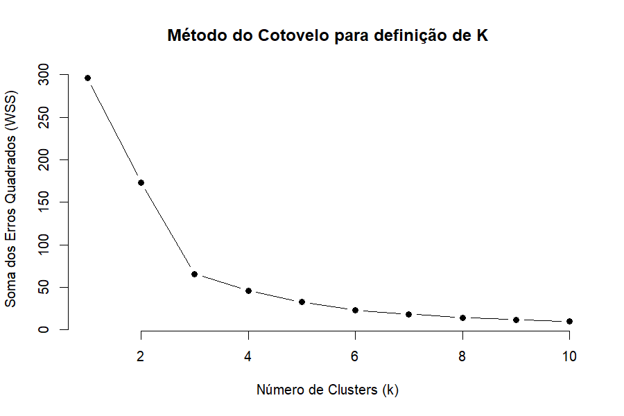
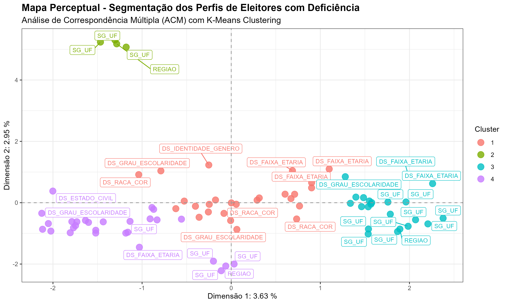
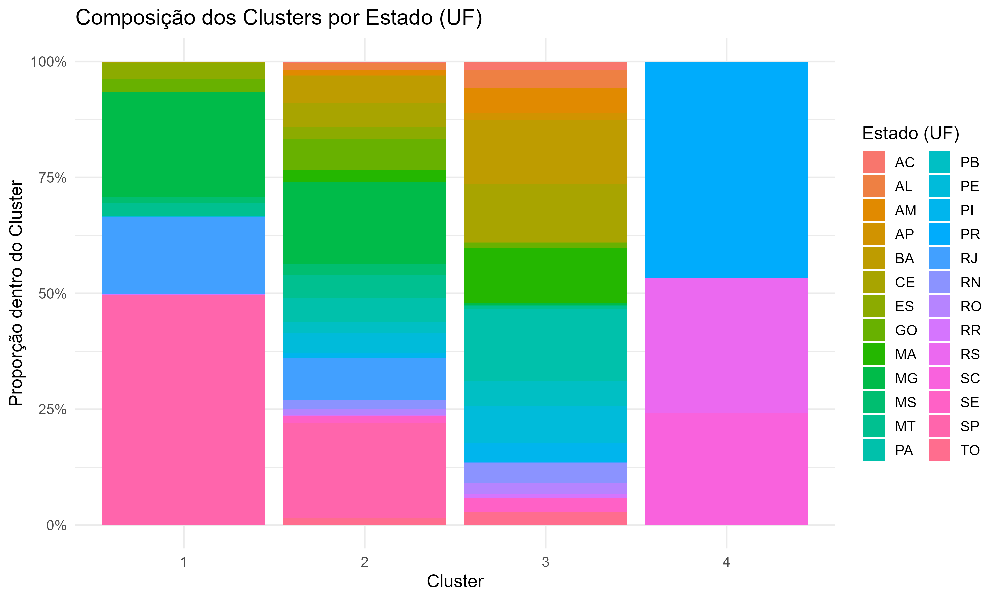
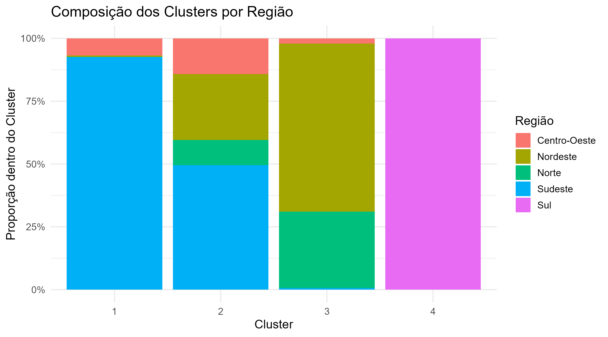

  
  
  
  
  

---

<h1 align="center">🗳️ Análise de Correspondência Múltipla (ACM) e Clusterização K-Means — Perfil dos Eleitores com Deficiência no Brasil</h1>

  <i>Projeto desenvolvido durante o MBA em Data Science e Analytics</i> 
  <i>Explorando dados eleitorais e padrões regionais de inclusão e acessibilidade</i>

---

## 🎯 Objetivo

Este projeto busca compreender **os perfis sociodemográficos dos eleitores com deficiência no Brasil**, analisando como variáveis como:

> 🧓 Faixa etária · 💍 Estado civil · 🧬 Raça · 🚻 Gênero · 🗺️ Estado · 🌎 Região · 🦽 Tipo de deficiência  

se relacionam entre si e **formam agrupamentos distintos de eleitores**.

A análise combina:
- **Análise de Correspondência Múltipla (ACM)** — para reduzir a dimensionalidade e revelar padrões entre variáveis categóricas;  
- **K-Means Clustering** — para segmentar grupos com características semelhantes.

---

## 🧩 Metodologia

| 🧱 Etapa | 📝 Descrição |
|----------|--------------|
| **1. Limpeza e preparação dos dados** | Tratamento, filtragem e padronização das variáveis |
| **2. ACM (Análise de Correspondência Múltipla)** | Redução dimensional e obtenção das coordenadas fatoriais |
| **3. K-Means Clustering** | Identificação de grupos homogêneos de eleitores |
| **4. Visualização e interpretação** | Mapas perceptuais e clusters por estado e região |
| **5. Geração de insights** | Interpretação dos perfis regionais e variáveis predominantes |

---

## ⚙️ K-Means Clustering — Resultados Técnicos

| 📊 Métrica | 🔍 Resultado |
|------------|--------------|
| **Número de Clusters (k)** | 4 |
| **Método de Definição** | Método do Cotovelo |
| **Variância Explicada** | ~63% nas duas primeiras dimensões |
| **Variáveis Utilizadas** | Coordenadas fatoriais da ACM (CS1, CS2) |

### 📉 Gráfico do Método do Cotovelo  

🔸 Representa a variação da soma dos erros quadrados (WSS) para diferentes valores de *k*.

---

## 🗺️ Mapas e Visualizações

### 🎯 Mapa Perceptual — K-Means Clustering  

🧩 Representa graficamente a relação entre as variáveis e a proximidade dos perfis de eleitores com deficiência.

---

### 🌎 Composição dos Clusters por Estado (UF)  

📊 Mostra a distribuição dos grupos (clusters) em cada unidade federativa.

---

### 🧭 Composição dos Clusters por Região  

📈 Mostra a distribuição dos grupos (clusters) por macrorregião brasileira.

---

## 🔍 Insights Analíticos

A partir da **Análise de Correspondência Múltipla (ACM)** foi possível identificar **padrões relevantes de associação** entre as variáveis sociodemográficas e a distribuição dos eleitores com deficiência no Brasil.

### 🌐 Principais Descobertas

| 🧠 Insight | 💬 Interpretação |
|------------|----------------|
| **Diferenças regionais marcantes** | Regiões **Sul** e **Sudeste** apresentaram perfis com maior escolaridade e predominância de deficiência visual. |
| **Norte e Nordeste** | Concentram eleitores com **deficiência física/locomoção**, menor nível de escolaridade e maior faixa etária. |
| **Associação tipo de deficiência x faixa etária** | Deficiências auditivas aparecem em faixas etárias mais elevadas, enquanto múltiplas deficiências surgem entre os mais jovens. |
| **Agrupamentos homogêneos** | O K-Means evidenciou **quatro grupos distintos**, alinhados a diferenças regionais e perfis educacionais. |

---

## 🧰 Ferramentas Utilizadas

| Categoria | Ferramenta |
|------------|-------------|
| **Linguagem** | R |
| **Pacotes** | `FactoMineR`, `factoextra`, `ggplot2`, `dplyr`, `plotly` |
| **Ambiente** | RStudio |
| **Visualizações** | Gráficos 2D e 3D, mapas perceptuais e análises comparativas |

---

## ✨ Autoria

**Projeto desenvolvido por [Cibelly Viegas](https://www.linkedin.com/in/cibelly-viegas-de-souza-0584a8160/)**  
📧 [cibelly.viegas@gmail.com](mailto:cibelly.viegas@gmail.com)  
🎓 MBA em Data Science e Analytics

---

